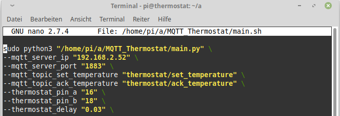

#  MQTT_Thermostat

## Follow the next steps to control your thermostat with a raspberry pi

## For hardware connection see:
https://www.youtube.com/watch?v=LlPHrdXHBTU

## Create a ssh connection to your pi
    ssh pi@192.168.x.x

## Step A: Create a new directory into your home directory and change to this one
    mkdir a
    cd a

## Step B: Check if you are in the directory "/home/pi/a"
    pwd

## Step 1: Download these two repositories
    git clone https://github.com/ThomasMoellerR/MQTT_Thermostat.git
    git clone https://github.com/eclipse/paho.mqtt.python

## Step 2: Install MQTT module for python3
    cd paho.mqtt.python
    sudo python3 setup.py install
    cd ..

## Step 3: Install tmux
    sudo apt-get install tmux

## Step 4: Install a new crontab by append the @reboot line
    crontab -e

`@reboot /bin/bash /home/pi/a/MQTT_Thermostat/tmux.sh`

## Step 5: Make tmux.sh executable
    sudo chmod +x /home/pi/a/MQTT_Thermostat/tmux.sh

## Step 6: Configure MQTT settings for your thermostat
    nano /home/pi/a/MQTT_Thermostat/main.sh

## Step 7: Reboot your Pi or start the tmux session manually
    sudo reboot

    or

    bash /home/pi/MQTT_Thermostat/tmux.sh

## --> Finish: When you arrive at this point, you are done

## Troubleshooting:

###  A: Set the Termostat to the operating state "manu" (see Youtube video)

###  B: Turn the encoder one step to the right or left (see Youtube video)

###  C: Check if the programm is running

with the command "tmux a" you can attach to a running session

    tmux a

with the command "ctrl+b" inside the session with a "d" followed you can detach from this session and the programm keeps running

    ctrl+b

    d

###  If the session is not running, try Steps 4, 5 and 7 again.
